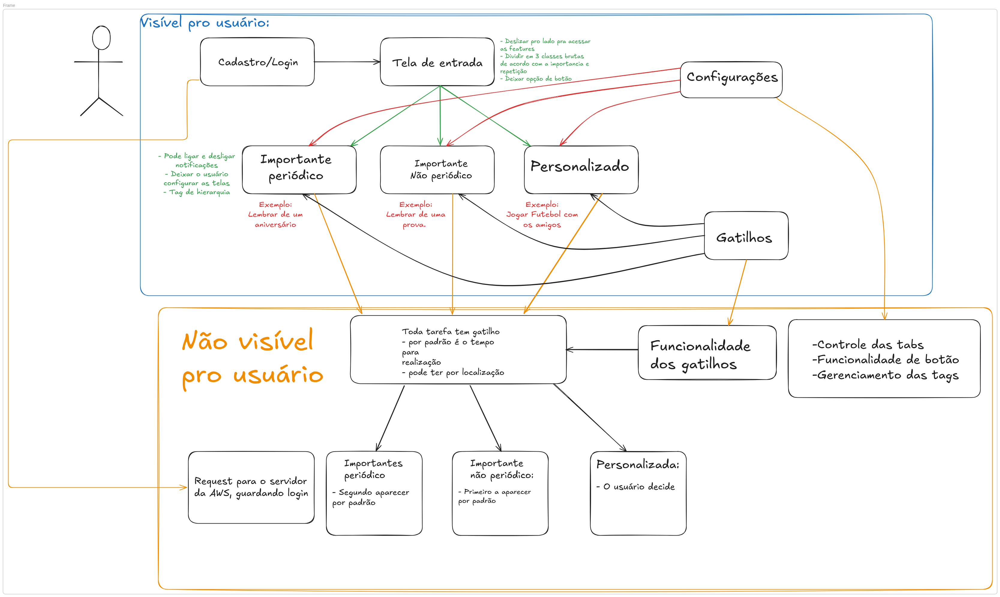
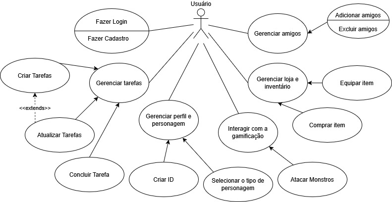
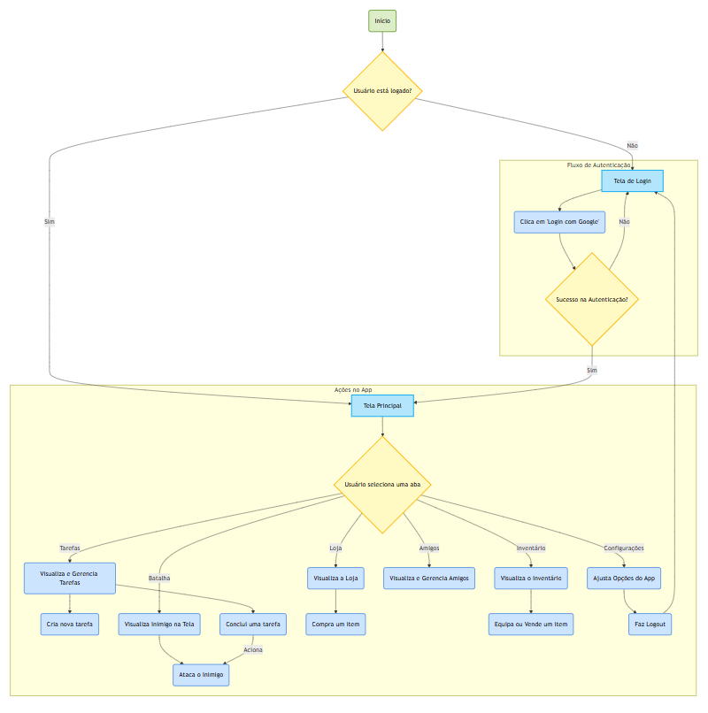
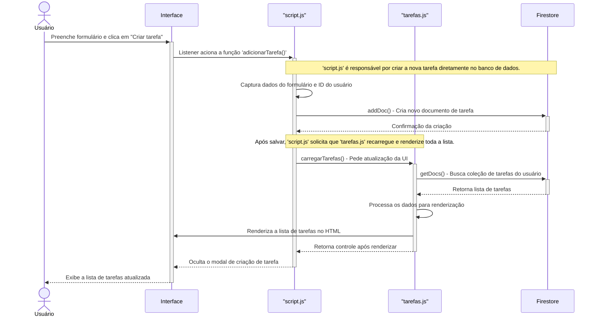
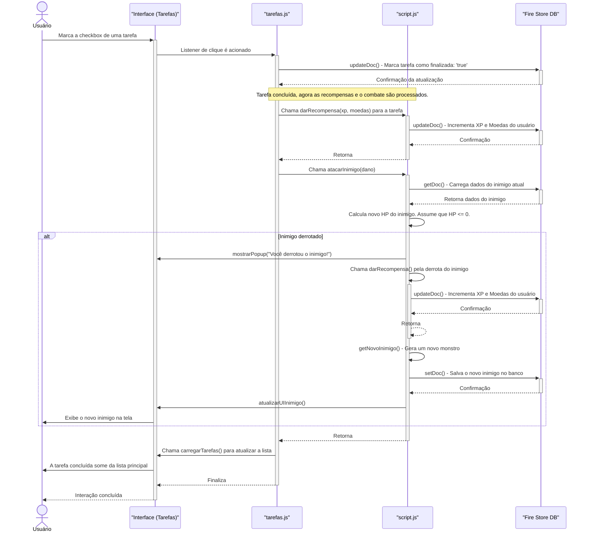
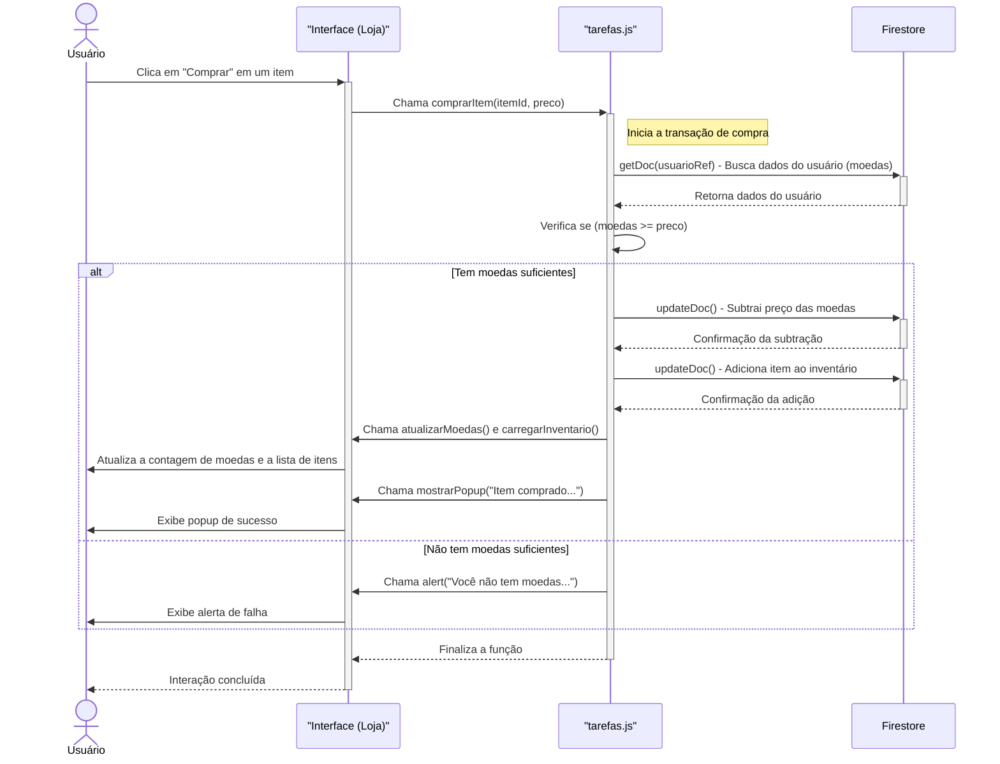

## Análise do Diagrama de Usuário Inicial — Projeto R.U.N.A.

O diagrama apresentado é uma representação clara e funcional da estrutura lógica inicial do aplicativo **R.U.N.A.**, dividida entre duas camadas principais: o que é **visível para o usuário** e o que é **não visível para o usuário**.

### Camada Visível para o Usuário

Esta camada reflete as interações diretas que o usuário terá com a interface do sistema, contemplando:

- **Cadastro/Login**: Entrada inicial no sistema, integrando autenticação com o backend (como citado abaixo).
- **Tela de Entrada**: Interface principal de acesso às tarefas e funcionalidades. Apresenta a categorização das tarefas em:
  - **Importante Periódico**: Tarefas recorrentes (ex: aniversários).
  - **Importante Não Periódico**: Tarefas pontuais (ex: prova).
  - **Personalizado**: Tarefas definidas livremente pelo usuário (ex: jogar futebol com amigos).
- **Configurações**: Permite personalização, ativação/desativação de notificações, definição de tags e ajuste visual.
- **Gatilhos**: Interface para ajuste de gatilhos relacionados a tempo ou localização.

### Camada Não Visível para o Usuário

Esta camada compreende a lógica de funcionamento do sistema, não acessada diretamente, mas fundamental para a operação correta da aplicação:

- **Request para o servidor AWS**: Responsável por armazenar e validar login dos usuários.
- **Classificação Padrão das Tarefas**: Estabelece uma ordem de prioridade e exibição, com:
  - Tarefas não periódicas importantes aparecendo primeiro.
  - Tarefas periódicas importantes em segundo.
  - Tarefas personalizadas sendo tratadas conforme decisão do usuário.
- **Gatilhos de Tarefa**: Todo tipo de tarefa está atrelado a um gatilho por tempo ou localização.
- **Funcionalidades Internas**: Inclui o controle de tabs, lógica de botões e gerenciamento de tags, crucial para a fluidez e funcionalidade da interface.

### Considerações

O diagrama está bem estruturado e evidencia preocupações essenciais no desenvolvimento da aplicação, como modularidade, usabilidade e lógica de funcionamento. Ele também ajuda a manter a visão clara da separação entre front-end e lógica de negócios (back-end), o que é essencial para a escalabilidade futura do R.U.N.A.

> Este mapeamento inicial fornece uma base sólida para futuras decisões de arquitetura e implementação, além de facilitar a comunicação entre desenvolvedores, designers e stakeholders.

### Diagrama de Casos de Uso

Este diagrama oferece uma visão de alto nível sobre **o que** o usuário pode fazer no sistema. É a representação das funcionalidades principais sob a perspectiva do usuário.

O **Diagrama de Casos de Uso** ilustra as principais interações e funcionalidades disponíveis para o **Ator "Usuário"** dentro da aplicação. Ele serve como um mapa funcional do sistema, definindo o escopo das ações que podem ser executadas. As funcionalidades são agrupadas em macro-áreas:

* **Autenticação**: O usuário pode realizar `Fazer Login` e `Fazer Cadastro` para acessar o sistema.
* **Gerenciamento de Tarefas**: O usuário pode `Criar Tarefas`, `Concluir Tarefa` e `Atualizar Tarefas`. A relação `<<extends>>` entre "Atualizar Tarefas" e "Criar Tarefas" indica que a atualização é uma funcionalidade que estende a criação, possivelmente ocorrendo em um momento posterior ou como uma variação.
* **Gerenciamento de Perfil e Personagem**: Inclui a criação de um `ID` de usuário, a seleção do `Tipo de Personagem` e outras interações com seu perfil.
* **Interação com a Gamificação**: O núcleo do engajamento, onde o usuário pode `Atacar Monstros` como recompensa por concluir tarefas.
* **Gerenciamento Social**: O usuário pode `Gerenciar amigos`, o que se desdobra em `Adicionar amigos` e `Excluir amigos`.
* **Gerenciamento de Loja e Inventário**: Permite ao usuário `Comprar Item` na loja e `Equipar Item` a partir do seu inventário para fortalecer seu personagem.

-----

### Fluxograma do Aplicativo

Este fluxograma detalha a **jornada do usuário** e a lógica de navegação dentro do aplicativo, mostrando os caminhos possíveis desde o início até a execução das principais ações.

O **Fluxograma da Aplicação** mapeia o fluxo de navegação do usuário. O processo se inicia com uma decisão crucial:

1.  **Verificação de Autenticação**: O sistema verifica se o "Usuário está logado?".

  * **Não**: O usuário é direcionado para a `Tela de Login`, onde pode tentar a autenticação (ex: "Clica em 'Login com Google'"). Em caso de sucesso, ele avança para a Tela Principal. Caso contrário, permanece no fluxo de autenticação.
  * **Sim**: O usuário é direcionado diretamente para a `Tela Principal`.

2.  **Ações na Tela Principal**: Uma vez logado, o usuário interage com uma navegação por abas. A partir da seleção de uma aba, ele pode executar diversas ações:

  * **Tarefas**: Visualiza, gerencia e cria novas tarefas.
  * **Batalha**: Visualiza o inimigo atual e, ao `Concluir uma tarefa`, pode `Atacar o Inimigo`.
  * **Loja**: Visualiza e compra itens.
  * **Amigos**: Gerencia sua lista de amigos.
  * **Inventário**: Visualiza e equipa os itens que possui.
  * **Configurações**: Ajusta opções do app e pode realizar `Faz Logout`, retornando ao início do fluxo.

-----

###  Diagramas de Sequência

Estes diagramas são fundamentais, pois detalham **como** as operações acontecem, mostrando a troca de mensagens entre os diferentes componentes do sistema (`Interface`, `scripts` e `Firestore`) ao longo do tempo.

#### Participantes Comuns:

* **Usuário**: O ator que inicia a interação.
* **Interface**: A camada de front-end com a qual o usuário interage (HTML/CSS).
* **script.js / tarefas.js**: Arquivos JavaScript que contêm a lógica de negócios do lado do cliente.
* **Firestore**: O banco de dados NoSQL (backend) que armazena todos os dados da aplicação.

#### Sequência de Criação de Tarefa

Este diagrama detalha o processo de **criação de uma nova tarefa**:

1.  O **Usuário** preenche o formulário e clica no botão "Criar Tarefa" na **Interface**.
2.  Um `listener` em `script.js` aciona a função `adicionarTarefa()`.
3.  `script.js` captura os dados do formulário e chama o **Firestore** para criar um novo documento (`addDoc()`) na coleção de tarefas.
4.  Após a confirmação do **Firestore**, `script.js` solicita que `tarefas.js` execute a função `carregarTarefas()` para atualizar a lista de tarefas.
5.  `tarefas.js` busca (`getDocs()`) a lista atualizada de tarefas do **Firestore**.
6.  Com os dados recebidos, `tarefas.js` processa e renderiza a nova lista de tarefas no HTML, retornando o controle para a **Interface**.
7.  A **Interface** oculta o modal de criação e exibe a lista de tarefas atualizada para o **Usuário**.

#### Sequência de Conclusão de Tarefa e Combate

Este diagrama descreve a sequência de eventos quando um **usuário conclui uma tarefa**, acionando as recompensas e o sistema de combate:

1.  O **Usuário** marca a checkbox de uma tarefa na **Interface**.
2.  Um `listener` em `tarefas.js` é ativado e marca a tarefa como `realizada` no **Firestore** (`updateDoc()`).
3.  Após a confirmação, `tarefas.js` inicia o fluxo de recompensas, chamando a função `darRecompensa()` em `script.js` para incrementar o XP e as moedas do usuário no **Firestore**.
4.  Em seguida, `tarefas.js` chama a função `atacarInimigo()` em `script.js` para iniciar o combate.
5.  `script.js` busca os dados do inimigo no **Firestore**, calcula o novo HP e entra em um **bloco alternativo (`alt`)**:
  * **[Inimigo derrotado]**: Se o HP do inimigo chega a zero, `script.js` concede recompensas pela derrota, gera um novo inimigo (`getNovoInimigo()`), salva-o no banco (`setDoc()`) e exibe um popup de vitória.
  * **[Inimigo não derrotado]**: O fluxo de combate termina aqui, e a vida atualizada do inimigo já foi salva.
6.  Finalmente, a interface é atualizada (`atualizarUInimigo()`, `carregarTarefas()`) para refletir o novo estado do inimigo e remover a tarefa concluída da lista principal.

#### Sequência de Compra de Item na Loja

Este diagrama ilustra o processo de **compra de um item na loja**, que envolve uma verificação de recursos do usuário:

1.  O **Usuário** clica em "Comprar" em um item na **Interface (Loja)**.
2.  A interface chama a função `comprarItem()` em `tarefas.js`, passando o ID e o preço do item.
3.  `tarefas.js` inicia a transação buscando os dados do usuário no **Firestore** (`getDoc()`) para verificar sua quantidade de moedas.
4.  Aqui, um **bloco alternativo (`alt`)** decide o fluxo com base nos recursos do usuário:
  * **[Tem moedas suficientes]**: Se `moedas >= preco`, `tarefas.js` executa duas atualizações no **Firestore**: subtrai o preço das moedas do usuário (`updateDoc()`) e adiciona o novo item ao seu inventário (`updateDoc()`). Após as confirmações, a interface é atualizada (`atualizarMoedas()`, `carregarInventario()`) e um popup de sucesso é exibido.
  * **[Não tem moedas suficientes]**: Se os fundos são insuficientes, a função chama um `alert()` na **Interface** informando a falha.
5.  A função é finalizada e a interação se conclui. 

