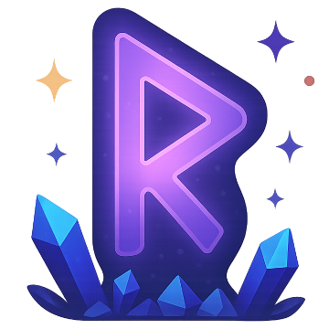

# Home

## Bem-vindo ao R.U.N.A.!

O **R.U.N.A.** — *Rotina Unificada Naturalmente Automatizada* — é um aplicativo inovador focado em transformar a forma como os usuários organizam suas tarefas diárias. Com uma proposta leve, interativa e totalmente gamificada, o projeto visa unir produtividade e motivação, criando um ambiente onde cada tarefa concluída representa uma conquista.

Mais do que um simples gerenciador de afazeres, o R.U.N.A. oferece uma experiência que valoriza o progresso do usuário, integrando recompensas, níveis e desafios em um sistema visual intuitivo. A ideia é clara: fazer com que a rotina se torne algo envolvente, onde o cumprimento de metas diárias contribui não apenas para organização pessoal, mas também para a evolução dentro de um universo simbólico e divertido.

Com recursos como autenticação de usuário, criação de tarefas por tipo (personalizadas, periódicas ou pontuais), possibilidade de anexar arquivos e visualização organizada por abas, o app busca facilitar o dia a dia sem deixar de lado a estética e a experiência do usuário.

Seja bem-vindo à sua nova forma de realizar tarefas. Seja bem-vindo ao universo R.U.N.A.

---

## Integrantes da E7 Studios

- Henrique de Freitas Araújo (ricosgames.henrique@gmail.com)
- Jader Oliveira Silva (jaderoliveira28@gmail.com)
- João Pedro Rodrigues Silva (jprs1308@gmail.com)
- Pedro Augusto Gontijo Moura (pedroaugustomoura70927@gmail.com)
- Rafael Adolfo Silva Ferreira (rafael.ferreira11.98@gmail.com)
- Rafael Ferreira da Rocha (rafaelrocha241003@gmail.com)
- Samuel Silva Gomes (silvagomes881@gmail.com)

